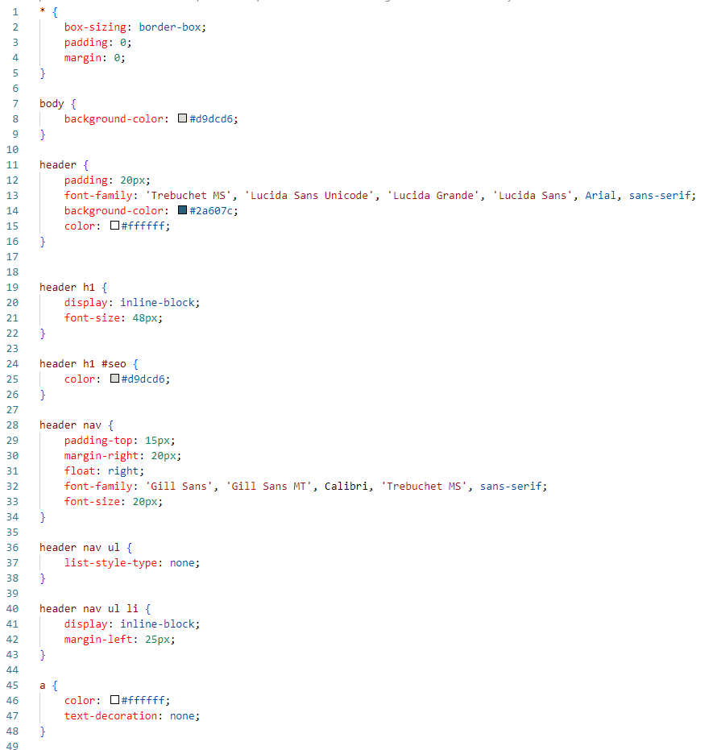
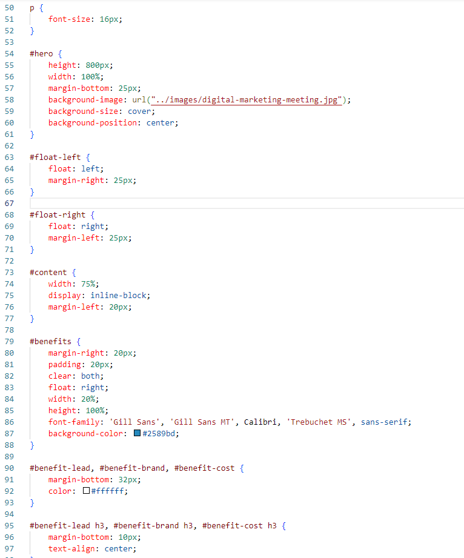
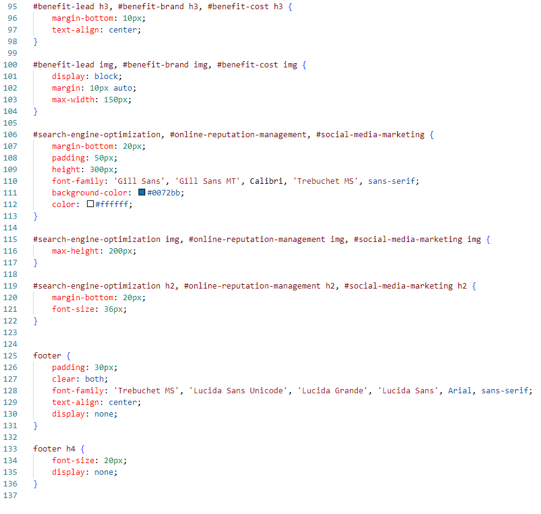
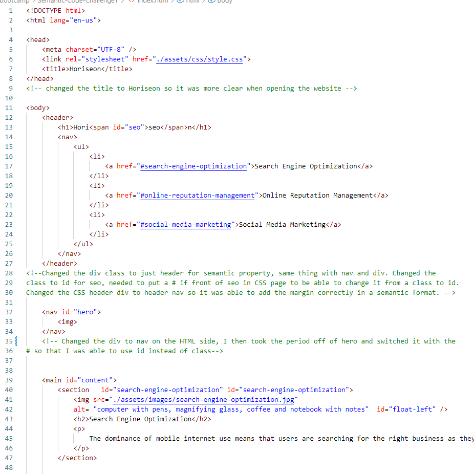
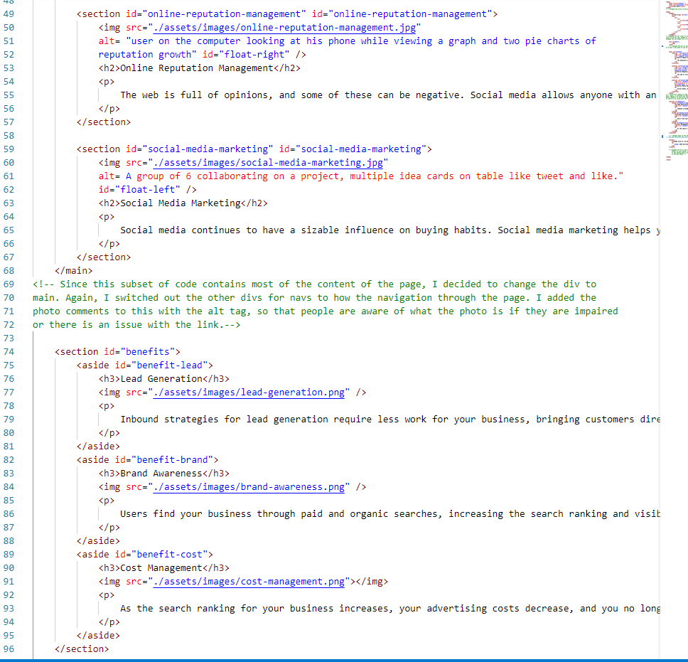
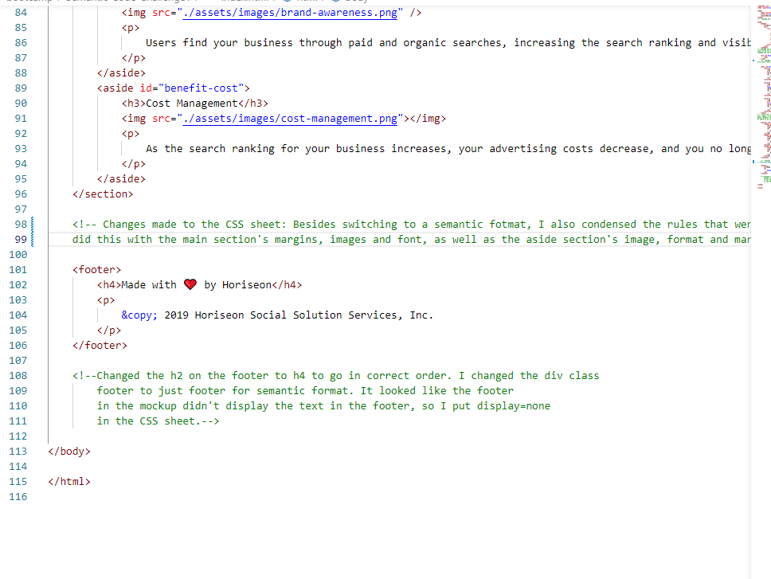

# Semantic-Code-Challenge1

## USER Story

AS A marketing agency
I WANT a codebase that follows accessibility standards
SO THAT our own site is optimized for search engines

## Description

In this challenge, I wanted to correct the structure of the HTML and CSS file to being semantic. I have provided all changes made in the CSS and HTML files as comments on each section. Lastly, I condensed all of the rules in the CSS file to make it more managable. 

## Installation

I have provided 2 links at the end of this page that should be able to work on any device.

## Screenshot of Changed Code

I have attached the coding changes I have made from the orginial script. I did not include the original script in the screenshots.

## The Result

I have updated the existing code to allow for a more efficient and semantically structured website for the client. This should be accessible on all devices.

## Links for Submission

Deployed website link: https://helenhosse.github.io/Semantic-Code-Challenge1/
GitHub repository link: https://github.com/helenhosse/Semantic-Code-Challenge1.git

## Credit

I referenced our class materials and received help from our TAs and my tutor Patrick Meehan.